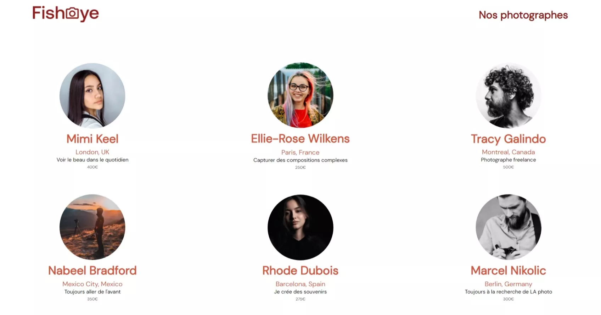

# Base de code du projet P6 - Parcours Front-end

## Démarrer le projet

1. Clone the project

    `git clone https://github.com/NWZX/NWZX_6_13012022` or `gh clone NWZX/NWZX_6_13012022`

2. Download one resources pack :
    
    [Normal](https://) / [Optimize](https://)

3. Extract resource pack at project root.

4. Open "index.html"

